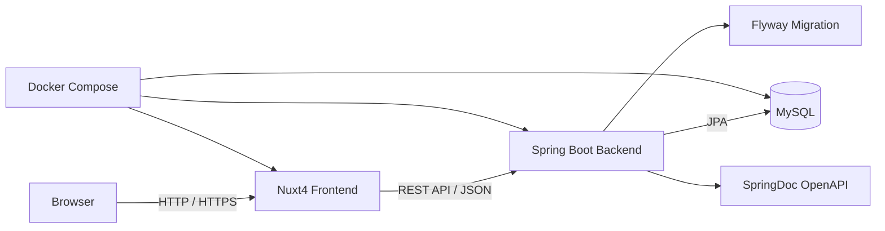

# システム全体アーキテクチャ

## 目的

本ドキュメントは、WorkHub のシステム全体構成を俯瞰するための設計書です。

バックエンド詳細は [backend.md](./backend.md)、フロントエンド詳細は [frontend.md](./frontend.md) に分離し、本ドキュメントではそれらを繋ぐ全体像を定義します。

---

## システム概要

WorkHub は、プロジェクト、タスク、工数を管理する業務システムです。

Spring Boot と Nuxt4 を用いたフルスタック開発を学びながら、実務に近い開発プロセス、設計、レビュー、リリースを経験することを目的としています。

MVPでは以下の機能を中心に実装します。

- 認証
- Project管理
- Task管理
- WorkLog管理

---

## システム構成図



将来的にはAWS上で以下の構成へ拡張します。

```text
Browser
  ↓
AWS
  ↓
ALB
  ↓
ECS
  ↓
RDS
```

---

## 技術スタック

| 分類 | 技術 |
|------|------|
| Frontend | Nuxt4, Vue 3, Tailwind CSS, Pinia |
| Backend | Java 21, Spring Boot 3, Spring Security, Spring Data JPA |
| Database | MySQL |
| Migration | Flyway |
| API Docs | SpringDoc OpenAPI |
| Infrastructure | Docker, Docker Compose |
| Future Infrastructure | AWS, ALB, ECS, RDS, S3 |

詳細な設計方針は以下に記載します。

- Backend: [backend.md](./backend.md)
- Frontend: [frontend.md](./frontend.md)

---

## システム間通信

WorkHub は、Nuxt4 と Spring Boot を REST API で接続します。

```text
Browser
  ↓
Nuxt4
  ↓ REST API(JSON)
Spring Boot
  ↓
MySQL
```

通信方針:

- フロントエンドはAPI経由でバックエンドと通信する
- APIレスポンスはJSON形式とする
- API仕様はSpringDoc OpenAPIから自動生成する
- エラーレスポンスはRFC7807(Problem Details)の採用を前提とする

---

## 認証方式

MVPでは Spring Security による Session認証を採用します。

Nuxt4からJSON形式でログインするため、Spring Security標準のフォームログインではなく、API用のログインエンドポイントを用意します。

認証方式のロードマップ:

```text
MVP
  ↓
Session認証
  ↓
JWT認証
  ↓
Refresh Token
  ↓
OAuth2 / Google Login
```

MVPでは学習を優先し、CSRFは一旦無効化します。

本番構成ではCSRF Cookie方式、SameSite属性、CORS設定を再検討します。

---

## ディレクトリ構成

プロジェクト全体は以下の構成を想定します。

```text
workhub/
├── backend/      # Spring Boot API
├── frontend/     # Nuxt4 frontend
├── infra/        # AWS, IaCなどの将来構成
├── docker/       # Docker関連設定
├── docs/         # 設計書、仕様書、学習ログ
└── README.md
```

各領域の詳細:

- `backend/`: Spring Boot、Spring Security、JPA、Flywayを用いたAPI
- `frontend/`: Nuxt4、Tailwind CSS、Piniaを用いた画面
- `infra/`: 将来的なAWS構成、IaC、デプロイ関連
- `docker/`: ローカル開発用のDocker設定
- `docs/`: 要件、API、画面、DB、アーキテクチャ、Milestoneを管理

backend内部の詳細は [backend.md](./backend.md) を参照します。

frontend内部の詳細は [frontend.md](./frontend.md) を参照します。

---

## 開発環境

MVPでは Docker Compose を使い、ローカルで以下を起動できる状態を目指します。

```text
Docker Compose
├── Nuxt4
├── Spring Boot
└── MySQL
```

開発時の基本方針:

- フロントエンドとバックエンドは分離して開発する
- API仕様はSpringDoc OpenAPIで確認する
- DBスキーマはFlywayで管理する
- 初期データはFlywayのmigration SQLを基本とする
- Dockerで再現可能な開発環境を作る

---

## デプロイ構成

### MVP

初期段階ではローカル開発環境を中心に構築します。

```text
Local
  ↓
Docker Compose
  ↓
Nuxt4 / Spring Boot / MySQL
```

### 将来

初回リリースに向けてAWS構成へ拡張します。

```text
AWS
├── ALB
├── ECS
├── RDS
├── S3
└── CloudWatch
```

将来的なデプロイ方針:

- GitHub ActionsでCI/CDを構築する
- BackendはECS上で稼働させる
- DatabaseはRDS MySQLを利用する
- Frontendの配信方式は構成に応じて検討する
- ログと監視はCloudWatchを利用する

---

## ロードマップ

WorkHub は、完成形を一度に実装せず、MVPから段階的に機能と技術を追加します。

```text
Phase1
Spring Boot + Nuxt4
  ↓
Phase2
Spring Security
  ↓
Phase3
Test
  ↓
Phase4
Docker
  ↓
Phase5
AWS
  ↓
Phase6
機能拡張
```

開発Milestoneの詳細は [Milestones](../milestones/index.md) を参照します。

---

## 本ドキュメントの位置付け

`system.md` は、現在の設計書であると同時に、プロジェクト全体の地図です。

新しくプロジェクトに参加した人が本ドキュメントを読むことで、WorkHubが何でできていて、どのように接続され、どの順番で拡張されていくのかを把握できる状態を目指します。
